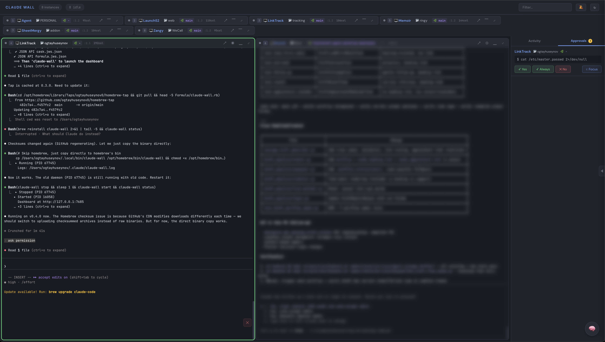

# Claude Wall

**Mission control for Claude Code — monitor, orchestrate, and interact with all your AI coding agents from one dashboard.**



## Features

- **Web Dashboard** — Real-time grid of all Claude Code instances in tmux
- **Live Terminal Capture** — 25fps streaming via tmux control mode (zero subprocess, ~2% CPU)
- **Status Indicators** — Idle (gray), working (green), permission needed (pulsing amber), error (red)
- **Permission Mode Badge** — Shows current mode: default, plan, acceptEdits, bypassPermissions
- **Activity Feed** — Chronological timeline of tool calls across all agents
- **Approval Queue** — One-click approve/deny pending permissions, with AskUserQuestion option buttons
- **Telegram Bot** — Approve permissions, answer questions, and send messages to agents from Telegram
- **PM View** — Project manager tab: see all agents' Claude Code tasks, progress bars, assign work
- **Scheduled Tasks** — Send recurring commands to agents on a timer with progress tracking
- **Webhooks** — Slack, Discord, Telegram, or generic HTTP webhooks for permission, error, and completion events
- **Secrets Management** — Secure storage for bot tokens and API keys (chmod 600, masked in UI)
- **Voice Input** — Real-time speech-to-text per tile via Web Speech API (auto-stops on silence)
- **Mastermind AI** — Orchestrator chat that reads, instructs, and coordinates all agents
- **Cost Tracking** — Per-session token usage and estimated cost breakdown (`/finance.html`)
- **Chrome Extension** — Send selected text or full page content to any agent
- **Drag & Drop Files** — Drop files onto tiles to send file paths to agents
- **Hooks Integration** — Native HTTP hooks (Claude Code 2.1+) with command fallback, 12 events
- **Keyboard Shortcuts** — `Ctrl+1-9` focus tiles, `Cmd+K` command palette, `Ctrl+Tab` cycle
- **Group Filter** — Filter tiles by project group or search by name
- **Daemon Mode** — Runs in background with `start`/`stop`/`restart`/`status`/`logs`
- **Remote Access** — `--public` flag binds to `0.0.0.0`, `--token` for authentication
- **Per-Pane Font Size** — Increase/decrease font size per tile via dropdown (A-/A+)
- **Blur Mode** — Hide sensitive content via tile dropdown menu
- **Drag to Reorder** — Rearrange tiles, order persists across reloads
- **Auto-detect** — New/removed Claude instances appear automatically
- **Sound Notifications** — Browser alerts for permission requests and task completion
- **Mobile Responsive** — Usable from phone via Tailscale
- **macOS Code Signing** — Signed and notarized binaries, no Gatekeeper warnings

## Install

**Homebrew (macOS & Linux):**
```bash
brew tap ogtayhuseynov0/tap
brew install claude-wall
```

**Binary download:**
```bash
# macOS (Apple Silicon)
curl -L https://github.com/ogtayhuseynov0/claude-wall/releases/latest/download/claude-wall-macos-arm64 -o ~/.local/bin/claude-wall
chmod +x ~/.local/bin/claude-wall

# macOS (Intel)
curl -L https://github.com/ogtayhuseynov0/claude-wall/releases/latest/download/claude-wall-macos-amd64 -o ~/.local/bin/claude-wall
chmod +x ~/.local/bin/claude-wall

# Linux (amd64)
curl -L https://github.com/ogtayhuseynov0/claude-wall/releases/latest/download/claude-wall-linux-amd64 -o ~/.local/bin/claude-wall
chmod +x ~/.local/bin/claude-wall
```

**From source:**
```bash
go install github.com/ogtayhuseynov0/claude-wall@latest
```

## Quick Start

```bash
claude-wall init    # install hooks + start dashboard + open browser
```

## CLI

| Command | Description |
|---|---|
| `claude-wall init` | Install hooks + start dashboard + open browser |
| `claude-wall start` | Start dashboard in background |
| `claude-wall stop` | Stop dashboard |
| `claude-wall restart` | Restart dashboard |
| `claude-wall status` | Check if running |
| `claude-wall logs` | Tail the dashboard log file |
| `claude-wall open` | Open dashboard in browser |
| `claude-wall list` | List detected Claude Code agents |
| `claude-wall uninstall` | Remove hooks + stop dashboard |

**Flags:**

| Flag | Description |
|---|---|
| `--public` | Bind to `0.0.0.0` for Tailscale/remote access |
| `--port PORT` | Custom port (default: `7685`) |
| `--token TOKEN` | Require authentication token (recommended with `--public`) |
| `--dry-run` | Preview `init` changes without applying them |

## Daemon Mode

Claude Wall runs as a background daemon. The server persists across terminal sessions.

```bash
claude-wall start                        # start in background
claude-wall start --public --token s3cr3t  # remote access with auth
claude-wall status                       # check if running
claude-wall logs                         # tail log output
claude-wall restart                      # restart the daemon
claude-wall stop                         # stop the daemon
```

The PID is stored at `~/.claude-wall.pid` and logs are written to `~/.claude/claude-wall.log`.

## Telegram Bot

Control your agents from your phone via Telegram. Approve permissions, answer questions, and send instructions — all without opening a terminal.

**Setup:**
1. Create a bot via [@BotFather](https://t.me/BotFather) and get the bot token
2. Message your bot to get your chat ID (open `https://api.telegram.org/bot<TOKEN>/getUpdates`)
3. In the dashboard: Webhooks tab → Secrets section → add `TELEGRAM_BOT_TOKEN` and `TELEGRAM_CHAT_ID`
4. Create a Telegram webhook using `$TELEGRAM_BOT_TOKEN` and `$TELEGRAM_CHAT_ID`

**What you can do:**
- **Permission requests** arrive with `[Yes] [Always] [No]` inline buttons — tap to approve
- **AskUserQuestion** shows the actual options as buttons — tap to select and approve in one step
- **Reply to any notification** to send text to that agent's pane
- `/agents` — list active agents, pick one, then type a message to send
- `/send AgentName your message here` — send directly to an agent

The bot auto-starts when a Telegram webhook with valid credentials exists. Rich notifications include session name, folder, branch, and last user prompt.

## PM View (Project Manager)

See what each Claude Code agent is working on. The PM tab reads Claude Code's internal task system (`~/.claude/tasks/`) and shows:

- **Per-tile progress badge** — `3/7` in the tile header (completed/total)
- **PM tab** in side panel — all agents grouped with progress bars
- **Task list** — expand any agent to see individual tasks (pending, in progress, completed)
- **Continue button** — send `/continue` to any agent
- **Assign work** — tap a pending task to send it to the agent

## Scheduled Tasks

Send recurring commands to agents on a timer — review loops, test runs, periodic checks.

**From the dashboard:** Side panel → Sched tab → fill in agent, command, interval, max runs → Create.

**From the API:**
```bash
# Create a task: run /review-fix-loop every 10 min, max 5 attempts
curl -X POST http://localhost:7685/api/scheduler/create \
  -H "Content-Type: application/json" \
  -d '{"target":"RiverAI","command":"/review-fix-loop 617","intervalMin":10,"maxAttempts":5}'

# Pause / resume / stop / delete
curl -X POST http://localhost:7685/api/scheduler/{id}/pause
curl -X POST http://localhost:7685/api/scheduler/{id}/resume
curl -X POST http://localhost:7685/api/scheduler/{id}/stop
curl -X POST http://localhost:7685/api/scheduler/{id}/delete
```

Tasks wait for the agent to go idle before sending the next cycle. Progress shows as `⏱ 2/5` badge on the tile header. Tasks persist across server restarts.

## Webhooks

Get notified in Slack, Discord, Telegram, or any HTTP endpoint when agents need attention.

**From the dashboard:** Side panel → Webhooks tab → add URL, select type, choose events → Create.

**Supported types:**
- **Telegram** — rich HTML notifications with inline action buttons (requires bot token + chat ID stored in Secrets)
- **Slack** — sends `{"text": "message"}` to your webhook URL
- **Discord** — sends `{"content": "message"}` to your webhook URL
- **Generic** — sends full JSON event payload to any HTTP endpoint

**Events:** `permission` (agent needs approval), `error` (agent failure), `stopped` (agent completed), `task_completed` (scheduled task finished)

**Management:** Enable/disable toggle, test button, delete with confirmation per webhook.

Webhooks are debounced (max 1 per event type per 30s) and persisted to `~/.claude/claude-wall-webhooks.json`.

## Secrets Management

Store sensitive values (bot tokens, API keys) securely on disk.

- Stored at `~/.claude/claude-wall-secrets.json` with `chmod 600`
- Values **never returned to the browser** — UI shows masked versions (e.g. `85****Cg`)
- Reference in webhook fields as `$SECRET_NAME` — resolved server-side at send time
- Add/delete from the Webhooks tab → Secrets section

## Voice Input

Click the mic button on any tile to dictate text using your browser's speech recognition.

- Real-time transcription — words appear as you speak
- Auto-stops after 3 seconds of silence
- Text is typed into the pane without pressing Enter (review first)
- Click mic again to stop manually
- Works in Chrome and Edge (Web Speech API)

## Dashboard Shortcuts

| Shortcut | Action |
|---|---|
| `Cmd+K` | Command palette |
| `Cmd+M` | Toggle Mastermind chat |
| `Ctrl+1-9` | Focus tile by number |
| `Ctrl+Tab` / `Shift+Tab` | Cycle between tiles |
| `Ctrl+F` | Filter/search tiles |
| Double-click header | Expand tile fullscreen |
| `Escape` | Exit expanded view |

## Mastermind AI

The brain button (or `Cmd+M`) opens an orchestrator chat that can:

- Summarize what all agents are doing
- Send instructions to any agent
- Approve/deny permissions
- Control dashboard UI (focus, zoom, minimize tiles)
- Coordinate multi-agent workflows

Model selector: Haiku (fast/cheap), Sonnet, or Opus per message. Uses `claude -p` — no separate API key needed.

## Architecture

```
Browser <--WebSocket--> Go Server <--tmux -C--> tmux server
                          |
                     Hook Server <-- Claude Code HTTP hooks
                          |
                     Telegram Bot <--> Telegram API (long poll)
                          |
                     Mastermind --> claude CLI (orchestrator)
                          |
                     Scheduler --> timed commands to agents
```

1. **tmux Control Mode** — persistent `tmux -C` connection, zero subprocess spawning
2. Captures all panes at 25fps via protocol messages (not `exec.Command`)
3. Content streamed to browsers via WebSocket (only sends diffs)
4. Claude Code hooks push structured events (PreToolUse, Stop, PermissionRequest, etc.)
5. Telegram bot enables remote approval and messaging via long-polling
6. Mastermind AI gets full context and can control agents + dashboard UI
7. Scheduler sends recurring commands to agents when they go idle
8. CPU usage: ~2-5% for 10+ agents (vs 10%+ with subprocess polling)

## Chrome Extension

Send text from any webpage to any Claude Code agent.

1. Download `extension.zip` from [releases](https://github.com/ogtayhuseynov0/claude-wall/releases)
2. Unzip, open `chrome://extensions`, enable Developer mode
3. Click "Load unpacked", select the `extension/` folder
4. Select text → right-click → **Send selection to Agent**
5. Or right-click anywhere → **Send page text to Agent** (works on Notion, etc.)

## Cost Tracking

Visit `/finance.html` (or click the cost button in the header) for:

- Total cost across all agents + mastermind
- Per-session breakdown: input/output/cache tokens, estimated cost, turns
- Data persists across restarts at `~/.claude/claude-wall-finance.json`

## Hooks

`claude-wall init` installs hooks that send real-time events to the dashboard:

- **HTTP hooks** (Claude Code 2.1+) — native, fast, no shell script
- **Command hooks** (fallback) — for older Claude Code versions
- **12 events tracked**: PreToolUse, PostToolUse, PostToolUseFailure, Stop, StopFailure, PermissionRequest, Notification, SessionStart, SessionEnd, SubagentStart, SubagentStop, TaskCompleted
- Safe merge — never overrides existing hooks
- `claude-wall init --dry-run` to preview changes
- `claude-wall uninstall` removes only claude-wall hooks

## Requirements

- **tmux 3.3+**
- **Claude Code** running in tmux sessions
- **Go 1.21+** (only for building from source)

## License

[MIT](LICENSE)
